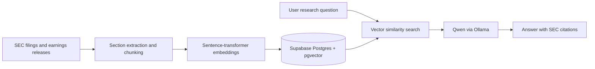

# Stratos

**AI-powered financial research platform for investigating public companies with market data, portfolio tools, and source-cited SEC filing analysis.**

> Stratos is built for research and education not stock-price prediction or investment advice.

## What it does

- Search supported public companies and view current price, daily movement, historical performance, company profiles, fundamentals, financial-health metrics, news, and filing timelines.
- Create named watchlists and track daily movement across saved stocks.
- Add portfolio purchase lots and view current value, profit/loss, allocation, and historical portfolio performance.
- Ask Sparky, the in-app financial research assistant, questions about a company’s filings.
- Receive answers grounded in retrieved 10-Ks, 10-Qs, and 8-K earnings releases, with links back to the original SEC sources.

## RAG research pipeline



The indexer covers a curated research universe of large public companies. It retrieves recent 10-K, 10-Q, and earnings-release material, extracts risk factors and management discussion sections, embeds the chunks, and stores them in pgvector for retrieval.

## Tech stack

| Area | Technology |
| --- | --- |
| Frontend | Next.js, React, TypeScript, Tailwind CSS, Recharts |
| Backend | FastAPI, Python |
| Data | Financial Modeling Prep, Alpha Vantage, SEC EDGAR |
| Auth and database | Supabase Auth, PostgreSQL, Row Level Security, pgvector |
| AI | sentence-transformers embeddings, Ollama, Qwen 2.5 |
| DevOps | Docker Compose, Caddy HTTPS reverse proxy, GitHub Actions |
| Deployment | AWS EC2, encrypted EBS volume, DuckDNS |

## Security and deployment

Stratos was deployed as Docker services on AWS EC2 behind Caddy with HTTPS enabled. The deployment keeps the FastAPI and Next.js services private behind the reverse proxy.

- Supabase Row Level Security isolates user profiles, watchlists, portfolio holdings, and research history.
- SEC-ingestion routes require a server-side admin token in production.
- Research requests are rate-limited in the API process.
- Environment variables and service-role credentials are kept out of version control.
- GitHub Actions verifies backend syntax and frontend lint/build checks on pushes.

The public EC2 demo instance is stopped when not in use to control cost. Starting it again may require updating the DuckDNS record with the instance’s new public IP.

## Local setup

### Prerequisites

- Node.js 22+
- Python 3.12+
- Docker Desktop (recommended for the full stack)
- A Supabase project with the included migrations applied
- API keys for Financial Modeling Prep and Alpha Vantage
- An SEC-compliant `SEC_USER_AGENT`

### Environment variables

Create `backend/.env`:

```env
SUPABASE_URL=...
SUPABASE_SECRET_KEY=...
FMP_API_KEY=...
ALPHA_VANTAGE_API_KEY=...
SEC_USER_AGENT=Your Name your-email@example.com
OLLAMA_BASE_URL=http://ollama:11434
OLLAMA_MODEL=qwen2.5:7b
```

Create a root `.env` for frontend build variables:

```env
NEXT_PUBLIC_SUPABASE_URL=...
NEXT_PUBLIC_SUPABASE_PUBLISHABLE_KEY=...
NEXT_PUBLIC_API_BASE_URL=http://localhost:8000
```

### Run with Docker

```bash
docker compose up --build -d
docker compose exec ollama ollama pull qwen2.5:7b
```

Open `http://localhost:3000`.

### Index SEC research material

```bash
cd backend
source venv/bin/activate
python -m scripts.index_research_universe
```

## Project structure

```text
stratos/
├── frontend/        # Next.js application
├── backend/         # FastAPI API, SEC ingestion, retrieval, and Ollama client
├── supabase/        # PostgreSQL / RLS migrations
├── .github/         # GitHub Actions verification workflow
├── docker-compose.yml
├── docker-compose.production.yml
└── Caddyfile
```

## Demo

[Watch the Stratos product demo on YouTube](https://youtu.be/n_wqMeqYYAo)

## Disclaimer

Stratos is a portfolio project for financial research and educational use. It does not provide investment advice, trading recommendations, or price predictions.
